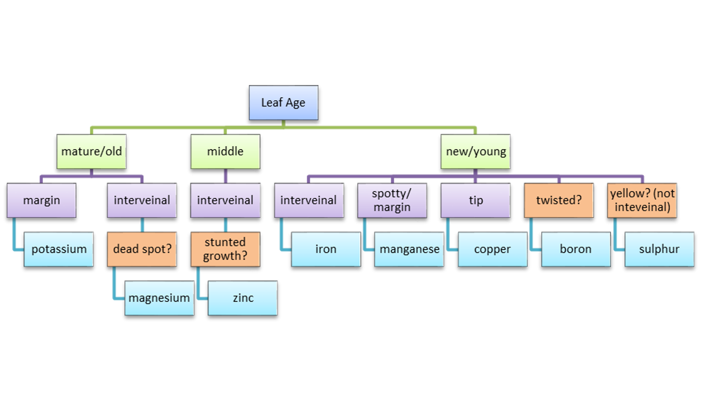
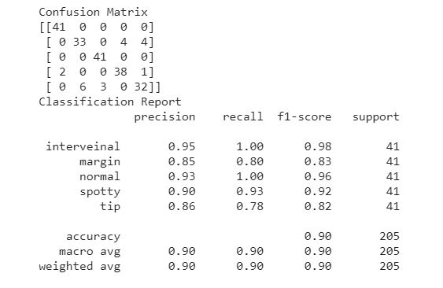

# fertilizer_recommendation
Help farmers better care for their plants nutritional needs

## Deployed application: 
    https://share.streamlit.io/quartz14/fertilizer_recommendation/main/first_app.py

CROPS FOCUSSED:
* Rice
* Wheat
* Maize

NUTRIENTS FOCUSSED:
* Potassium
* Magnesium
* Zinc
* Iron
* Manganese
* Copper
* Boron
* Sulphur
* Nitrogen deficiency levels - only for rice

FLOW:
* User can upload an image of the leaf(that begins to show some symptoms like loss of color(chlorosis), drying(necrosis))
* The model runs on the image and classifies it into 1 of 5 symptoms ['interveinal', 'margin', 'normal', 'spotty', 'tip']
* Uses user input on age of leaf (new/old/middle) and presence of 4 additional symptoms (not capture in leaf image), like stunted growth of entire plant.
* Using this infomation and the research on identifying nutrient deficiencies (done by Montana State University, U.S. Department of Agriculture), the following rules are developed.

* These results are further used to recommend appropriate fertilizers to the farmer, helping in **avoiding overfertilization** by adding standard fertilizers recommended to crop grown and **control costs**

SCREENSHOTS
* Few predictions of model trained to identify nutrient deficiency symptoms:

Application screenshots
* Home page 

* Image upload and analysis page

* Results upon analysis page

* Fertilizer recommendation (in progress)

* Some more model prediction examples (note the confusion between margin and tip class)

FILES:
* fertilizer.xls - Excel file containing the data on fertilizers. It has 2 pages which needs to be updated with the info collected
* first_app.py - The web application that is view by users
* 200_epoch_97_87_soft.h5 - neural network model for classifying leaf image into 1 of 5 classes ['interveinal', 'margin', 'normal', 'spotty', 'tip']
* plain2model.tflite - neural network model for classifying rice leaf image into 1 of 4 classes based on LCC
* nn_model_basic.ipynb - Jupyter notebook containing code used to train nn model
* SessionState.py - library to allow use of session in application

TO DO:
* Collect info on fertilizers based on stage of crop(Ex: seedling, established, flowering, mature), type of crop (Ex: rice,wheat, maize), per acre for nutrients: 'Potassium', 'Magnesium', 'Zinc', 'Iron', 'Manganese', 'Copper', 'Boron' and 'Sulphur'
* Add images to manual symptoms in results page to make it easier for user
